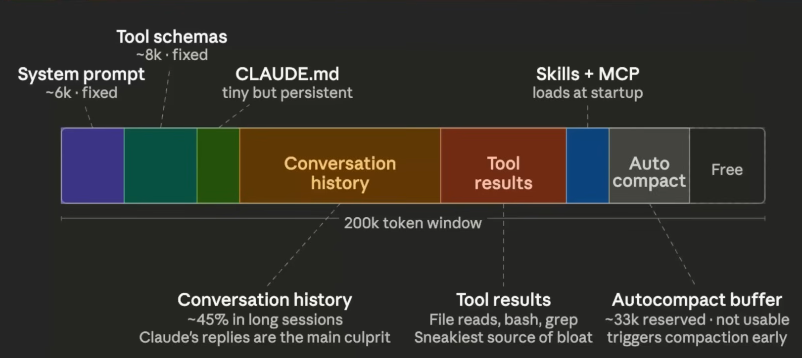

# Agentic Coding with `Claude Code`

## Not a `Vibe Coding`
- It is a modern software development approach where a person relies heavily on AI to generate, refine and debug the code based on Natural Language prompts
  - Plan English
  - AI Generate a code
  - Iterative refinement
  - basically, low stacks projects
- but can't be much good for high stacks projects who relies on scalable systems, critical infra based software

## Why Claude Code?
- best for raw coding experience
- best for long context handling
- better at refactoring and architecture
- agentic capabilities
- it behaves like a senior engineer

## Claude Code setup:
  - If have money to purchase plan go with terminal command `claude`
  - else go with `ollama` by running command as `ollama launch claude`

## Slash commands:
Slash commands are the shorts you type inside the claude code `session` starting with `/` that trigger a specific predefined action or workflow instantly **without writing a full prompt**
  - built-in
  - custom-one created by you

## a bit more about `Session` in Claude Code
- one session = one task (this will save the context window and over charge from model tokens)
- name your session immediately, default its generating based on qtns asked initially
  - to rename use /rename {the title you wanna give to this session}
  - to list all the sessions run `claude -r`
- commit frequently within a session once reaching a milestone
- use `/btw` i.e by-the-way to ask quick questions which you don't want to be part of the session
- export a session before a big refractor  -->> do it by command `/export file.md` so the conversation will get exported
- to see a complete list of slash, type `/` and scroll up-or-down but arrow keys

## Models
- `Opus`: 
  - most powerful but high expensive, used for complex programming task
- `Sonnet`: 
  - the default, best balance speed, quality and token cost and good for everyday coding task
- `Haiku`: 
  - fastest and cheapest; use for simple, repetitive or exploratory tasks where you don't need deep reasoning

- to change models, run the command `/model` and will be able to see the list of models

- to see usage, run `/usage`

- `/extra-usage`: sometimes you may hit allocated quota, and you need more limit then as a top-up this feature can be used

- `/stats`: getting usage information based like total session counts, longest-session, active days, most active day, etc etc..

- to use more efficiently and understand the insights in your pattern usages run `/insights` which will generate HTML file which contents all the crucial information about your usage and how to make it better

- `/config` -->> see model's configuration like thinking mode, language, etc etc

- `/permission` -->> allow permissions for tools

- `/voice` -->> to interact with models by voice instead typing

## Context Window Management
- A `context window` is the amount of information (in tokens) that a model like Claude Code can see and remember at one time while generating a response. Think of it as the model's working memory.
- A `Context` is all the information available to understand something correctly.
- Context window = the maximum amount of context the model can hold at once.

| Codebase | PRD / Spec | JIRA / GitHub issues |
|----------|------------|----------------------|
| Existing functions, folder structure, naming conventions, patterns, dependencies | Requirements, user stories, acceptance criteria, scope, edge cases | Task definition, back-and-forth decisions in comments, links to PRD |

| Slack / messages | Previous AI chats | Git history / PRs |
|------------------|------------------|-------------------|
| Decisions made in passing, direction changes, warnings about fragile code | Explored approaches, tried solutions, decisions already made with Claude | Past decisions, reverted attempts, review comments, why code looks as it does |

### `**Important**` Context of Models
  - Claude Code has a context window of 200k tokens {check official doc for updated token number}.
  - Each new session starts with a fresh context window.
  - Tokens are consumed by both your messages and Claude's replies.
  - Claude's replies consume roughly 6x more tokens than your messages.
  - Every request sends the entire conversation history from scratch.
  - Subagents get their own isolated context window completely separate from the main session. Subagents return only a summary to the main context and not their full working history.
  

  
  

- run `/context` to understand which `context usage` using which how much token from the category as shown above

### why context window matters ?
  - its affects cost
  - It Shapes How You Should Structure Your Workflow
  - Response Quality Degrades as Context Fills Up
    1. Stage 1: Quality Degrades
    2. Stage 2: Auto-Compaction Triggers (~75-92% Full)
    3. Stage 3: Repeated Compaction Causes Corruption
    4. Stage 4: Hard Stop
  - **Solution :**
    - use `/compact` after some chat messages instead Claude deicides as it auto and in middle of any crucial task if it run then Claude models might loose that IMP information, ultimately loss of tokens
    - Start a sub-agent for the next task
    - `/clear` or start a new session
  - **Good Practice :**
    - One session per feature
    - Use /compact (Proactively, Not Reactively)
    - Write Focused, Specific Prompts
    - Use Subagents for Isolated or Exploratory Work
    - Use .claudeignore to Keep Irrelevant Files Out
